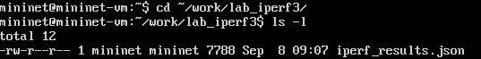

---
## Author
author:
  name:  Богаткина Алёна Александровна 
  degrees: DSc
  orcid: 0000-0002-0877-7063
  email: kulyabov-ds@rudn.ru
  affiliation:
    - name: Российский университет дружбы народов
      country: Российская Федерация
      postal-code: 117198
      city: Москва
      address: ул. Миклухо-Маклая, д. 6

## Title
title: Отчет по Лабораторной работе №2
subtitle: Моделирование сетей передачи данных
license: "CC BY"
---

# Цель работы

Целью данной работы является знакомство с инструментом для измерения пропускной способности сети в режиме реального времени - iPerf3, а также получение навыков проведения интерактивного эксперимента по измерению пропускной способности моделируемой сети в среде Mininet

# Задание

1. Установить на виртуальную машину mininet iPerf3 и дополнительное программное обеспечения для визуализации и обработки данных
2. Провести ряд интерактивных экспериментов по измерению пропускной способности с помощью iPerf3 с построением графиков

# Выполнение лабораторной работы

## Установка необходимого программного обеспечения

Запустили виртуальную среду с mininet. Из основной ОС подключились к виртуальной машине: ```ssh -Y mininet@192.168.56.104``` ([рис. @fig-001]), ([рис. @fig-002])

{#fig-001 width=70%}

{#fig-002 width=70%}

После подключения к виртуальной машине mininet посмотриели IP-адреса машины и убедилиь что активен второй интерфейс (адрес NAT): ```ifconfig``` ([рис. @fig-003])

{#fig-003 width=70%}

Обновили репозитории программного обеспечения на виртуальной машине: ```sudo apt-get update``` ([рис. @fig-004])

{#fig-004 width=70%}

Установили iperf3: ```sudo apt-get install iperf3``` ([рис. @fig-005])

{#fig-005 width=70%}

Далее установили необходимое дополнительное программное обеспечение на виртуальную машину: ```sudo apt-get install git jq gnuplot-nox evince``` ([рис. @fig-006])

{#fig-006 width=70%}

Далее начали развёртывание iperf3_plotter. Для этого перешли во временный каталог и скачали репозиторий: ```cd /tmp``` и ```git clone https://github.com/ekfoury/iperf3_plotter.git``` ([рис. @fig-007])

{#fig-007 width=70%}

После этого установили iperf3_plotter: ```cd /tmp/iperf3_plotter```, ```sudo cp plot_* /usr/bin``` и ```sudo cp *.sh /usr/bin``` ([рис. @fig-008])

{#fig-008 width=70%}

## Интерактивные эксперименты

Задали простейшую топологию, состоящую из двух хостов и коммутатора с назначенной по умолчанию mininet сетью 10.0.0.0/8: ```sudo mn --topo=single,2 -x```. После введения этой команды запустились терминалы двух хостов, коммутатора и контроллера. Терминалы коммутатора и контроллера можно закрыть ([рис. @fig-009])

{#fig-009 width=70%}

В терминале виртуальной машины посмотрели параметры запущенной в интерактивном режиме топологии ([рис. @fig-010]):

```
mininet> net
mininet> links
mininet> dump
```

{#fig-010 width=70%}

Далее провели простейший интерактивный эксперимент по измерению пропускной способности с помощью iPerf3

В терминале h2 запустили сервер iPerf3: ```iperf3 -s```. После запуска этой команды хост h2 перешёл в состояние прослушивания 5201-го порта в ожидании входящих подключений В терминале хоста h1 запустили клиент iPerf3: ```iperf3 -c 10.0.0.2```. Здесь параметр -c указывает, что хост h1 настроен как клиент, а параметр 10.0.0.2 является IP-адресом сервера iPerf3 (хост h2) ([рис. @fig-011])

{#fig-011 width=70%}

Проанализировали полученный в результате выполнения теста сводный отчёт, отобразившийся как на клиенте, так и на сервере iPerf3, содержащий следующие данные:

- ID: идентификационный номер соединения, который равен 7
- интервал (Interval): временной интервал для периодических отчетов о пропускной способности (по умолчанию временной интервал равен 1 секунде)
- передача (Transfer): сколько данных было передано за каждый интервал времени. Было передано от 3.53 до 3.68 GBytes
- пропускная способность (Bitrate): измеренная пропускная способность в каждом временном интервале. От 30.3 до 31.6 Gbits/sec
-  Retr: количество повторно переданных TCP-сегментов за каждый временной интервал (это поле увеличивается, когда TCP-сегменты теряются в сети из-за перегрузки или повреждения). В нашем случае 0
– Cwnd: указывает размер окна перегрузки в каждом временном интервале (TCP использует эту переменную для ограничения объёма данных, которые TCP-клиент может отправить до получения подтверждения отправленных данных). Фиксированное значение 8.10 MBytes

Суммарные данные на сервере аналогичны данным на стороне клиента iPerf3.

Далее провели аналогичный эксперимент в интерфейсе mininet. Запустили сеервер iPerf3 на хосте h2: ```mininet> h2 iperf3 -s &```. Запустили клиент iPerf3 на хосте h1: ```mininet> h1 iperf3 -c h2``` ([рис. @fig-012])

{#fig-012 width=70%}

После остановили серверный процесс командой ```mininet> h2 killall iperf3``` ([рис. @fig-013])

{#fig-013 width=70%}

Далее сравнили результаты. Увидили, что во втором случае было передано на 1.3 GBytes меньше, а пропускная способность уменьшилась на 1.1

Для указания iPerf3 периода времени для передачи можно использовать ключ -t (или --time) - время в секундах для передачи (по умолчанию 10 секунд). В терминале h2 запустили сервер iPerf3: ```iperf3 -s```. В терминале h1 запустили клиент iPerf3 с параметром -t, за которым следует количество секунд: ```iperf3 -c 10.0.0.2 -t 5``` ([рис. @fig-014])

{#fig-014 width=70%}

Далее настроили клиент iPerf3 для выполнения теста пропускной способности с 2-секундным интервалом времени отсчёта как на клиенте, так и на сервере. Использовали опцию -i для установки интервала между отсчётами, измеряемого в секундах.В терминале h2 запустили сервер iPerf3: ```iperf3 -s -i 2```. В терминале h1 запустили клиент iPerf3: ```iperf3 -c 10.0.0.2 -i 2``` ([рис. @fig-015])

{#fig-015 width=70%}

Далее сравнили результаты. Видно что интервал увеличился в два раза, в результате чего в два раза увеличился также вес переданный за один интервал времени, а пропускная способность и суммарные величины почти не изменились

Задали на клиенте iPerf3 отправку определённого объёма данных. Использовалм опцию -n для установки количества байт для передачи. В терминале h2 запустили сервер iPerf3: ```iperf3 -s```. В терминале h1 запустили клиент iPerf3, задав объём данных 16 Гбайт: ```iperf3 -c 10.0.0.2 -n 16G``` ([рис. @fig-016])

{#fig-016 width=70%}
 
По умолчанию iPerf3 выполняет измерение пропускной способности в течение 10 секунд, но при задании количества данных для передачи клиент iPerf3 будет продолжать отправлять пакеты до тех пор, пока не будет отправлен весь объем данных, указанный пользователем. В нашем случае передача прошла за меньшее время (7.88 секунд)

Изменили в тесте измерения пропускной способности iPerf3 протокол передачи данных с TCP (установлен по умолчанию) на UDP. iPerf3 автоматически определяет протокол транспортного уровня на стороне сервера. Для изменения протокола использовали опцию -u на стороне клиента iPerf3. В терминале h2 запустили сервер iPerf3: ```iperf3 -s```. В терминале h1 запустили клиент iPerf3, задав протокол UDP: ```iperf3 -c 10.0.0.2 -u``` ([рис. @fig-017])

{#fig-017 width=70%}

После завершения теста отобразились следующие сводные данные:

- ID, интервал, передача, битрейт: то же, что и у TCP
- Jitter: разница в задержке пакетов
- Lost/Total: указывает количество потерянных дейтаграмм по сравнению с общим количеством отправленных на сервер (и процентное соотношение)

Далее в тесте измерения пропускной способности iPerf3 изменили номер порта для отправки/получения пакетов или датаграмм через указанный порт. Использовали для этого опцию -p. В терминале h2 запустили сервер iPerf3, используя параметр -p, чтобы указать порт прослушивания: ```iperf3 -s -p 3250```. В терминале h1 запустили клиент iPerf3, указав порт: ```iperf3 -c 10.0.0.2 -p 3250``` ([рис. @fig-018])

{#fig-018 width=70%}

По умолчанию после запуска сервер iPerf3 постоянно прослушивает входящие соединения. В тесте измерения пропускной способности iPerf3 задали для сервера параметр обработки данных только от одного клиента с остановкой сервера по завершении теста. Для этого использовалм опцию -1 на
сервере iPerf3. В терминале h2 запустили сервер iPerf3, используя параметр -1, чтобы принять только одного клиента: ```iperf3 -s -1```. В терминале h1 запустите клиент iPerf3: ```iperf3 -c 10.0.0.2``` ([рис. @fig-019])

{#fig-019 width=70%}

После завершения этого теста сервер iPerf3 немедленно остановился. 

Экспортировали результаты теста измерения пропускной способности iPerf3 в файл JSON. Для этого сначала в виртуальной машине mininet создали каталог для работы над проектом: ```mkdir -p ~/work/lab_iperf3``` ([рис. @fig-020])

{#fig-020 width=70%}

В терминале h2 запустили сервер iPerf3: ```iperf3 -s```. В терминале h1 запустили клиент iPerf3, указав параметр -J для отображения вывода результатов в формате JSON: ```iperf3 -c 10.0.0.2 -J``` ([рис. @fig-021])

{#fig-021 width=70%} 

В данном случае параметр -J выведел текст JSON на экран через стандартный вывод (stdout) после завершения теста.

Экспортировалм вывод результатов теста в файл, перенаправив стандартный вывод в файл: ```iperf3 -c 10.0.0.2 -J /home/mininet/work/lab_iperf3/iperf_results.json``` ([рис. @fig-022])

{#fig-022 width=70%} 

Остановили сервер iPerf3 и завершили работу mininet в интерактивном режиме ([рис. @fig-023])

{#fig-023 width=70%} 

В виртуальной машине mininet исправили права запуска X-соединения. Для этого скопируем значение куки (MIT magic cookie) пользователя mininet в файл для пользователя root ([рис. @fig-024]):

```
mininet@mininet-vm:~$ xauth list $DISPLAY
mininet-vm/unix:10 MIT-MAGIC-COOKIE-1 "значение для MIT-MAGIC-COOKIE"
mininet@mininet-vm:~$ sudo -i
root@mininet-vm:~# xauth add mininet-vm/unix:10 MIT-MAGIC-COOKIE-1 "значение для MIT-MAGIC-COOKIE"
root@mininet-vm:~# logout
```

{#fig-024 width=70%}

В виртуальной машине mininet перешли в каталог для работы над проектом, проверили и при необходимости скорректировали права доступа к файлу JSON: ```sudo chown -R mininet:mininet ~/work``` ([рис. @fig-025])

{#fig-025 width=70%} 

Сгенерировали выходные данные для файла JSON iPerf3, выполнив команду ```plot_iperf.sh iperf_results.json``` ([рис. @fig-026])

{#fig-026 width=70%} 

Сценарий построения должен был создать файл CSV (1.dat) и в подкатологе results должен был создать графики для полей файла JSON (приведены в тексте лабороторной работы). Так как во время выполнения у меня была проблема с версией python, я поставила последнюю версию. Поэтому структура и содержание каталогов немнго отличается

Далее убедились что файлы с данными и графиками сформировались ([рис. @fig-027]), ([рис. @fig-028]), ([рис. @fig-029])

{#fig-027 width=70%} 

{#fig-028 width=70%} 

{#fig-029 width=70%} 

# Выводы

В ходе выполнения лабораторной работы №2 мы познакомились с инструментом для измерения пропускной способности сети в режиме реального времени - iPerf3, а также получили навыки проведения интерактивного эксперимента по измерению пропускной способности моделируемой сети в среде Mininet

# Список литературы

1. [Лаборатораня работа №2](https://esystem.rudn.ru/pluginfile.php/3318932/mod_resource/content/1/002-lab_iperf3-1.pdf)
2. [iPerf3](https://iperf.fr/)

